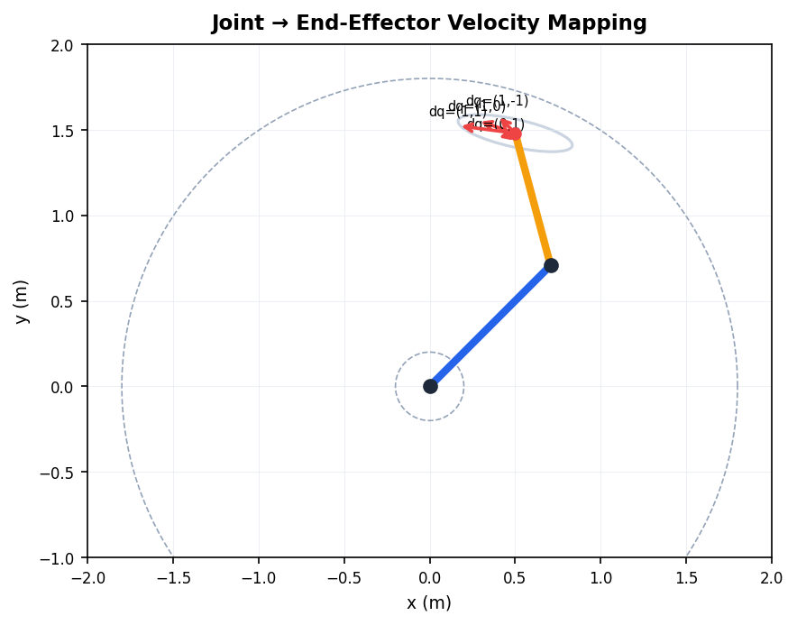
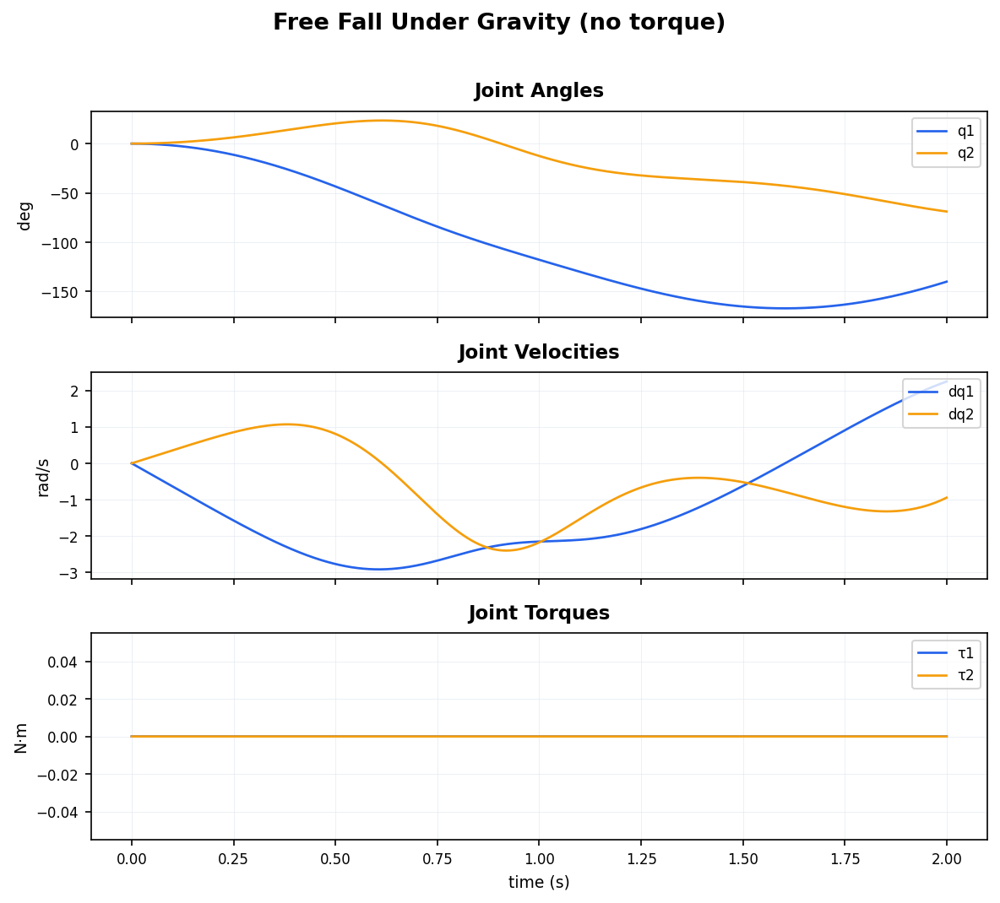
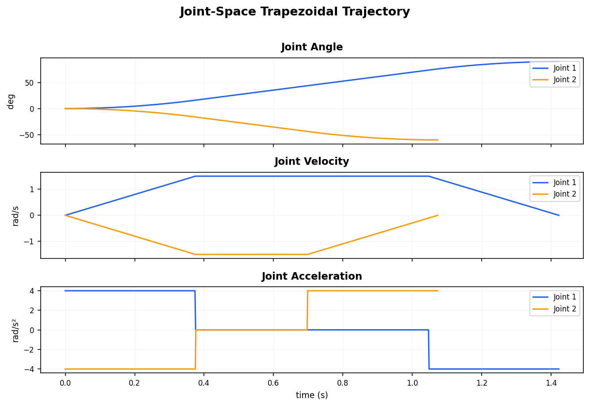

# Robot Fundamentals

从零实现串联机械臂的运动学、动力学与轨迹规划算法。全部基于 NumPy 构建，不依赖任何外部机器人库。

## 项目结构

```
robot-fundamentals/
├── core/
│   ├── kinematics.py      # DH 变换、正/逆运动学、雅可比矩阵
│   ├── dynamics.py        # 质量矩阵、科里奥利矩阵、正/逆动力学、仿真
│   ├── trajectory.py      # 梯形与 S 曲线速度规划
│   └── visualization.py   # 机械臂绘制、轨迹图表
├── examples/
│   ├── 01_kinematics.py   # 正/逆运动学演示
│   ├── 02_jacobian.py     # 雅可比与可操作性分析
│   ├── 03_dynamics.py     # 动力学仿真与 PD 控制
│   └── 04_trajectory.py   # 轨迹规划对比
└── assets/                # 自动生成的图表
```

## 快速开始

```bash
git clone https://github.com/<your-username>/robot-fundamentals.git
cd robot-fundamentals
pip install numpy matplotlib
python examples/01_kinematics.py
python examples/02_jacobian.py
python examples/03_dynamics.py
python examples/04_trajectory.py
```

---

## 1. 正运动学与逆运动学

以平面 2R 机械臂为对象（连杆长度 l₁=1.0m，l₂=0.8m），基于标准 DH 参数法实现。

**正运动学**：给定关节角 (θ₁, θ₂)，通过齐次变换矩阵逐级相乘求末端位姿：

$$T = \prod_{i=1}^{n} T_i(q_i), \quad T_i = Rot_z(\theta_i) \cdot Trans_z(d_i) \cdot Trans_x(a_i) \cdot Rot_x(\alpha_i)$$

**逆运动学**：给定目标位置 (x, y)，解析求解两组解（肘上/肘下）：

$$\cos\theta_2 = \frac{x^2 + y^2 - l_1^2 - l_2^2}{2 l_1 l_2}$$

<p align="center">
  
</p>

**正运动学验证结果：**

| 关节角 (θ₁, θ₂) | 末端位置 (x, y) |
|---|---|
| (30°, 45°) | (1.073, 1.273) |
| (60°, -30°) | (1.193, 1.266) |
| (-20°, 90°) | (1.213, 0.410) |
| (90°, 0°) | (0.000, 1.800) |

**逆运动学多解演示**：实线为肘上解，半透明为肘下解。

<p align="center">
  
</p>

| 目标位置 | 肘上解 (θ₁, θ₂) | 肘下解 (θ₁, θ₂) |
|---|---|---|
| (1.2, 0.8) | (1.5°, 74.0°) | (65.9°, -74.0°) |
| (0.5, 1.4) | (40.2°, 69.1°) | (100.5°, -69.1°) |
| (-0.8, 0.6) | (96.0°, 113.6°) | (190.3°, -113.6°) |

**工作空间**：遍历所有关节角组合，可达范围为 |l₁-l₂| ≤ r ≤ l₁+l₂ 的环形区域。

<p align="center"></p>

---

## 2. 雅可比矩阵与可操作性分析

几何雅可比矩阵建立关节速度与末端速度的线性映射：

$$\dot{x} = J(q) \cdot \dot{q}, \quad J_i = \begin{bmatrix} z_i \times (p_e - p_i) \\ z_i \end{bmatrix}$$

**可操作性指标**（Yoshikawa）衡量机械臂在当前构型下的运动灵活度：

$$w = \sqrt{\det(J \cdot J^T)}$$

当 w→0 时机械臂处于**奇异位置**（如完全伸直 θ₂=0° 或完全折叠 θ₂=180°），在某些方向失去运动能力。

**可操作性热力图**：红色曲线标注奇异位置（w≈0）。

| 可操作性热力图 | 不同构型的速度椭圆 |
|---|---|
|  |  |

**速度映射演示**：同一构型下，不同关节速度输入对应的末端速度方向。

<p align="center"></p>

---

## 3. 拉格朗日动力学与控制

基于拉格朗日方程建立操作臂动力学模型：

$$\tau = M(q)\ddot{q} + C(q, \dot{q})\dot{q} + g(q)$$

其中 M(q) 为质量矩阵（通过各连杆质心雅可比矩阵构建），C(q,q̇) 为科里奥利矩阵（通过第一类 Christoffel 符号计算），g(q) 为重力项。

**逆动力学验证**（q=(45°,30°)，dq=(0.5,-0.3) rad/s，ddq=(0.1,0.2) rad/s²）：

| 动力学量 | 计算结果 |
|---|---|
| 质量矩阵 M | [[5.991, 2.026], [2.026, 1.195]] |
| 重力项 g | [18.392, 2.437] N·m |
| 所需力矩 τ | (19.497, 2.999) N·m |
| 正动力学反验证误差 | 3.92×10⁻¹⁶ |

### 自由落体仿真

初始水平姿态 q=(0°,0°)，不施加力矩，在重力作用下自由运动 2 秒。

| 运动快照 | 关节角 / 速度 / 力矩曲线 |
|---|---|
|  |  |

### PD + 重力补偿控制

跟踪正弦参考轨迹，控制律为：

$$\tau = K_p(q_d - q) + K_d(\dot{q}_d - \dot{q}) + g(q)$$

参数设置：Kp = diag(50, 30)，Kd = diag(10, 6)。

<p align="center"></p>

实线为实际轨迹，虚线为期望轨迹。可以观察到初始阶段有跟踪延迟，稳态后跟踪误差较小。

---

## 4. 轨迹规划

### 梯形速度规划 vs S 曲线速度规划

**梯形**（bang-coast-bang）：加速度为阶跃信号，速度曲线呈梯形，存在加速度突变。

**S 曲线**（7 段式）：引入加加速度（jerk）限制，加速度连续过渡，减少机械振动。

<p align="center"></p>

规划参数：v_max=2.0 rad/s，a_max=5.0 rad/s²，j_max=30.0 rad/s³（S 曲线），运动范围 0 → 90°。

### 笛卡尔直线路径

末端执行器沿直线从 (1.2, 0.5) 运动到 (0.3, 1.3)，通过逆运动学逐点转换为关节角度。

<p align="center"></p>

### 关节空间轨迹

双关节同步运动：关节1从 0° → 90°，关节2从 0° → -60°。

<p align="center"></p>

---

## 理论参考

- **运动学**：Denavit-Hartenberg 参数法、几何雅可比矩阵、Yoshikawa 可操作性指标
- **动力学**：基于复合刚体算法的拉格朗日公式；由第一类 Christoffel 符号构造科里奥利矩阵
- **轨迹规划**：时间最优梯形速度曲线与七段 S 曲线

## License

MIT
