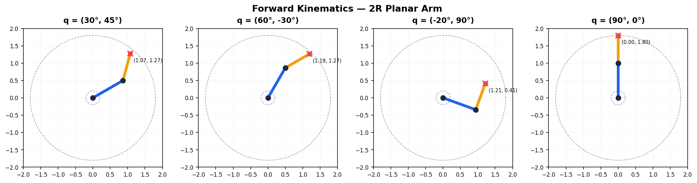
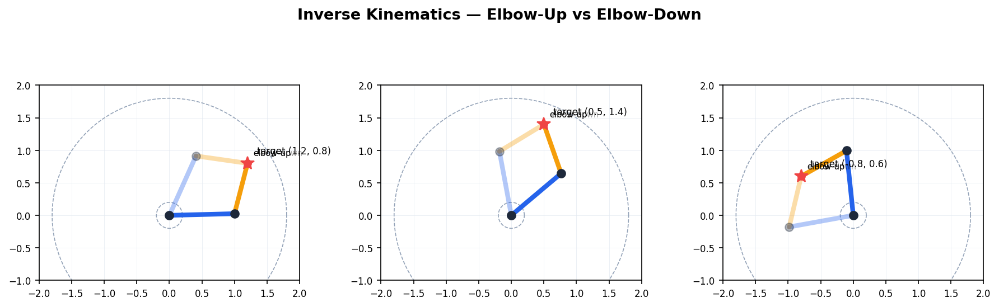
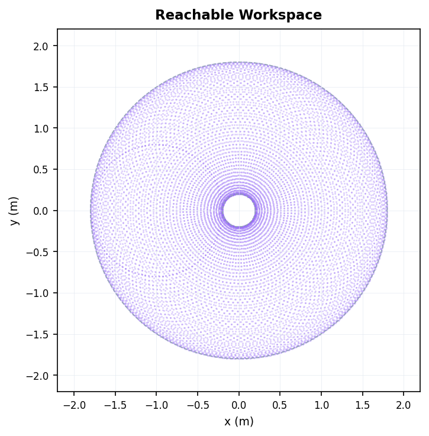
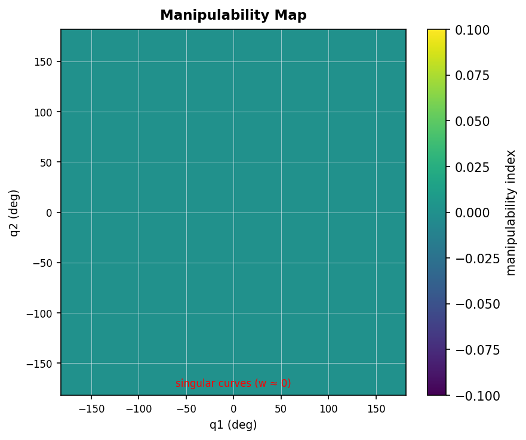
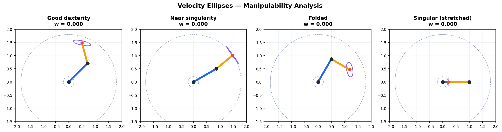
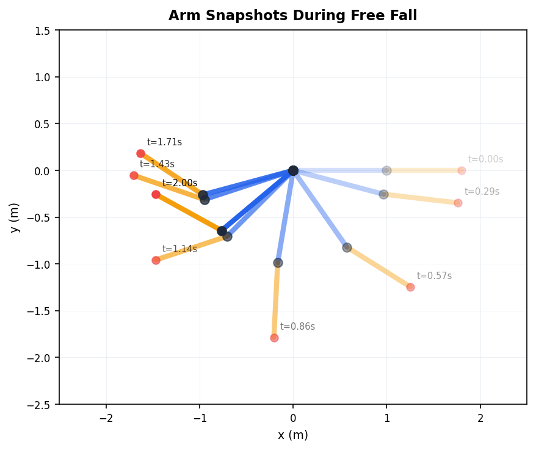
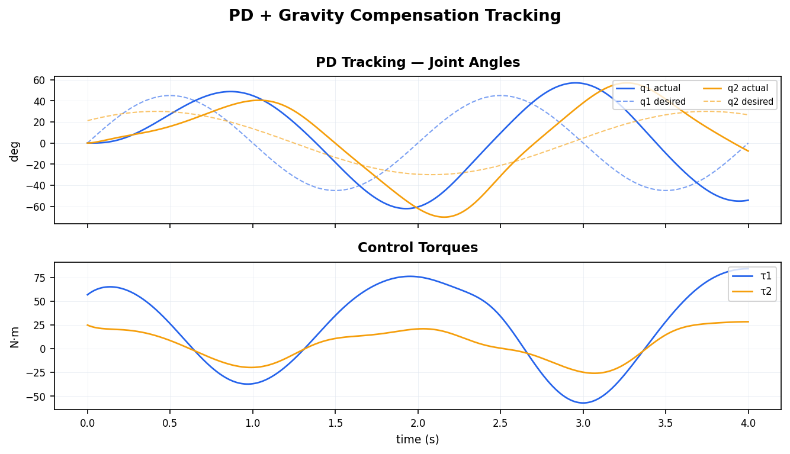
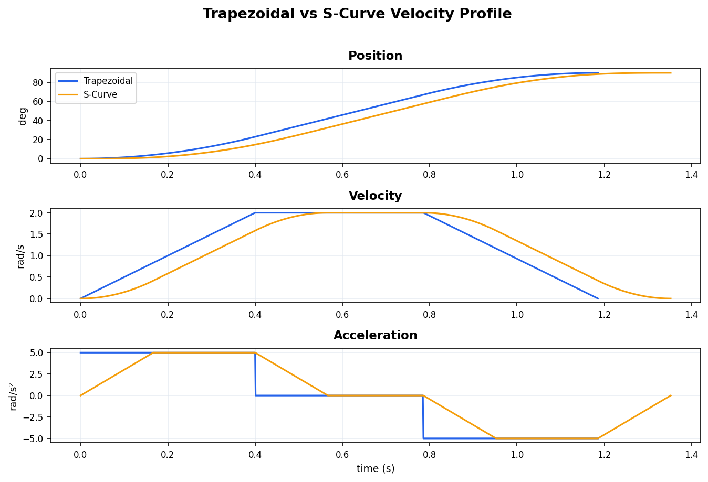
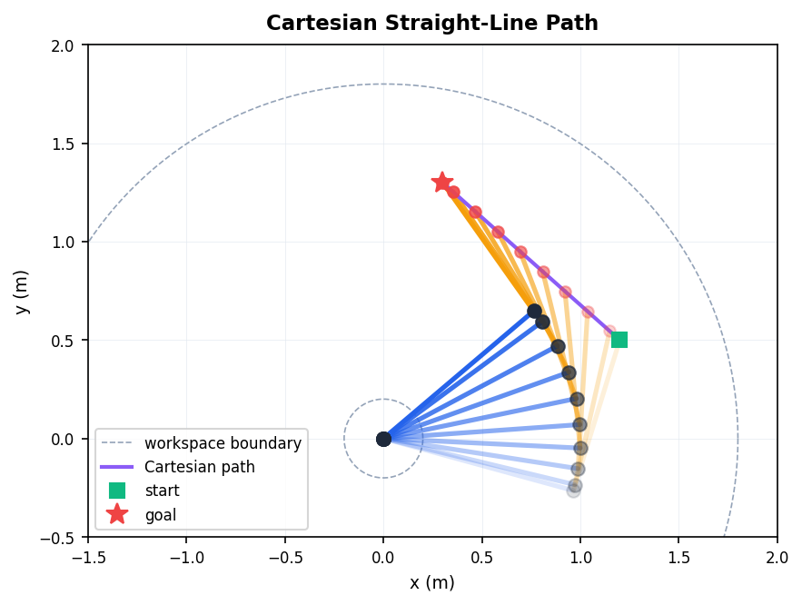

# Robot Fundamentals

From-scratch implementation of robot kinematics, dynamics, and trajectory planning for serial-link manipulators.  All algorithms are built on NumPy with no external robotics libraries, demonstrating a clear understanding of the underlying mathematics.

<p align="center">
  
</p>

## Highlights

- **DH-convention kinematics** — forward/inverse kinematics with analytic and numerical (damped least-squares) solvers.
- **Geometric Jacobian** — velocity mapping, manipulability ellipses, and singularity analysis.
- **Lagrangian dynamics** — mass matrix, Coriolis/centrifugal (Christoffel symbols), gravity vector; forward & inverse dynamics.
- **Simulation engine** — Euler integration with pluggable torque policies (free-fall, PD + gravity compensation).
- **Trajectory planning** — trapezoidal and S-curve velocity profiles for joint-space and Cartesian straight-line motions.
- **Visualisation** — every module produces publication-quality matplotlib figures; no MuJoCo/Isaac Sim required to run.

## Repository Structure

```
core/
  kinematics.py      DH transforms, FK, IK, Jacobian, manipulability
  dynamics.py        Mass matrix, Coriolis, gravity, forward/inverse dynamics, simulation
  trajectory.py      Trapezoidal & S-curve planners, Cartesian line planner
  visualization.py   Arm drawing, ellipses, trajectory & dynamics plots

examples/
  01_kinematics.py   FK at multiple configs, analytic IK (elbow-up/down), workspace
  02_jacobian.py     Manipulability map, velocity ellipses, velocity mapping
  03_dynamics.py     Inverse/forward dynamics, free-fall sim, PD tracking
  04_trajectory.py   Trapezoid vs S-curve, Cartesian path, joint profiles

assets/              Auto-generated figures (see below)
```

## Quick Start

```bash
# clone
git clone https://github.com/<your-username>/robot-fundamentals.git
cd robot-fundamentals

# install dependencies (just NumPy + matplotlib)
pip install numpy matplotlib

# run all examples and generate figures
python examples/01_kinematics.py
python examples/02_jacobian.py
python examples/03_dynamics.py
python examples/04_trajectory.py
```

## Example Outputs

### 1. Forward & Inverse Kinematics

| Forward Kinematics | Inverse Kinematics (elbow-up / elbow-down) |
|---|---|
|  |  |

**Workspace coverage:**

<p align="center"></p>

### 2. Jacobian & Manipulability

| Manipulability Map | Velocity Ellipses |
|---|---|
|  |  |

### 3. Dynamics & Control

| Free Fall (snapshots) | PD + Gravity Compensation Tracking |
|---|---|
|  |  |

### 4. Trajectory Planning

| Trapezoidal vs S-Curve | Cartesian Straight Line |
|---|---|
|  |  |

## Theory Reference

The implementation follows standard robotics textbooks:

- **Kinematics**: Denavit-Hartenberg convention, geometric Jacobian, Yoshikawa manipulability index.
- **Dynamics**: Lagrangian formulation via composite-rigid-body algorithm; Coriolis matrix from Christoffel symbols of the first kind.
- **Trajectory**: Time-optimal trapezoidal (bang-coast-bang) and 7-segment S-curve profiles.

## License

MIT
